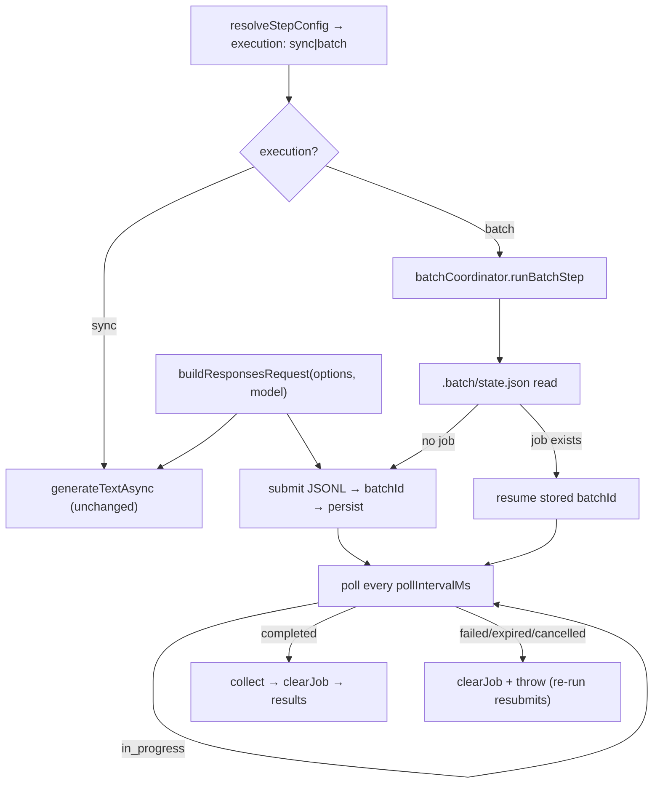

# Plan: OpenAI Batch API support (cost reduction)

## Context

Running the pipeline on full lectures with a top-tier OpenAI model is expensive. OpenAI's
**Batch API** charges ~**50% less** for the *same model* in exchange for asynchronous turnaround
(submit → poll → collect, SLA "within 24h", usually faster). The user processes lectures
**offline** and accepts **overnight turnaround**; typical lectures split into 9+ audio parts, so
the per-part AI steps (cleaning, handout) dominate cost.

**Goal:** add an **opt-in batch execution mode** for the three AI steps (cleaning, handout,
summary) that keeps today's model/quality but pays the batch price, while leaving the current
synchronous behaviour as the default.

Verified against the code: `resolveStepConfig` (`src/services/ai/aiServiceFactory.ts:181`) is the
single merge point for per-step provider/model; `OpenAiService.generateTextAsync`
(`src/services/ai/openai/openaiAiService.ts:41`) builds a `responses.create` request inline;
`runPipeline` returns before any step runs when `dryRun` is set (`src/pipeline/runPipeline.ts:85`).
Confirmed externally that the OpenAI Batch API supports the `/v1/responses` endpoint with
`completion_window: "24h"`, so the same request body works for sync and batch — no prompt drift.

## Flow



Both the sync service and the batch JSONL builder call the **same** `buildResponsesRequest`, so
prompt shape is identical. Steps run sequentially (handout needs cleaned files; summary needs
handout) → a full batch run is up to **3 sequential batch jobs**, automatic under auto-watch.

## Prompt tailoring for batch mode (required)

**The current prompts assume the sync, sequential approach and MUST be tailored for batch.** Today
every AI step uses one provider-independent system prompt (profile preset + language instruction +
optional override) written for incremental, single-document processing — e.g. handout relies on
"CONTINUATION… continue numbering from section N" hints injected into the `userPrompt`
(`handoutStep.ts:126`), and cleaning relies on the previous *cleaned* tail. Batch changes the task
shape (independent parallel parts + a merge), so the prompts must change with it. This is explicit,
in-scope work — not optional polish. Prompts remain **provider-independent**; the axis that varies is
**execution mode (sync vs. batch)**, defined as inline step-level constants alongside the existing
`summaryStep` merge prompt.

| Step | Batch prompt change | Why |
|------|--------------------|-----|
| **Cleaning** | append `CLEANING_BATCH_ADDENDUM` to the cleaning system prompt | model now sees prev/next **raw** neighbor excerpts; must clean only THIS part and stay terminology-consistent |
| **Handout** | Stage-1 `HANDOUT_DRAFT_ADDENDUM` (draft one part; no global intro/conclusion; no global numbering) **and** Stage-2 `buildHandoutMergePrompt(langCode)` (unify, renumber from 1, dedupe, smooth transitions) | map-reduce replaces incremental numbering; drafts are independent, merge owns global structure |
| **Summary** | none | single-pass batch == sync single pass; chunked already has its own chunk + merge prompts |

All batch prompts append the output-language instruction from `config.language.output` (matching
`resolveOpenAiConfig`) and are non-overridable in v1. Exact placement is detailed per step in
section 9.

## 1. Config types & validation

- `src/config/config.types.ts`
  - `StepAiConfig`: add `execution?: "sync" | "batch"` (default `"sync"`).
  - `AiConfig`: add `batch?: { pollIntervalMs?: number; maxWaitMs?: number }`
    (defaults: `pollIntervalMs` 30000; `maxWaitMs` undefined = wait indefinitely).
- `src/config/loadConfig.ts`
  - `validateUserConfig`: where `ai.default.overrides` and `steps.*.aiConfig` are validated, also
    accept `execution` and require it to be `"sync"`|`"batch"`. Validate `ai.batch.pollIntervalMs`
    / `ai.batch.maxWaitMs` are positive numbers when present.
  - `validateFinalConfig`: after the existing per-step provider-pool checks (around
    `src/config/loadConfig.ts:571`), for each AI step compute resolved `execution`
    (`steps[step].aiConfig.execution ?? ai.default.execution`) and resolved provider; if
    `execution === "batch"` and provider !== `"openai"`, push
    `"Step '<step>': execution 'batch' requires provider 'openai'"`.
- `src/config/config.defaults.ts`: leave `execution` unset (implicit sync) — no change for existing configs.

## 2. Neighbor-context fields (quality)

To preserve cross-part continuity **without** a sequential dependency, batch requests carry
reference-only excerpts of the surrounding raw parts (the AI reads boundary context before/after
its own part but does not re-emit it). Since all raw transcripts exist before cleaning runs (ASR
already finished) and all cleaned files exist before handout runs, these neighbors are available
up-front — every part can be submitted in one job.

- `src/services/ai/ai.types.ts`: add to `AiGenerateOptions`:
  `previousChunkExcerpt?: string` (tail of the preceding part) and
  `nextChunkExcerpt?: string` (head of the following part). Both optional; absent in today's
  sync paths so no behaviour change.
- `src/config/profilePresets.ts`: add two formatters next to the existing
  `formatPreviousOutputExcerptPrompt`: `formatPrecedingContextPrompt(text)` and
  `formatFollowingContextPrompt(text)`, each wrapping the excerpt as reference-only context
  (e.g. *"END of the PRECEDING part — for continuity only, do NOT include it in your output:"* /
  *"START of the FOLLOWING part — for continuity only, do NOT include it in your output:"*).

### Position encoding — absence is meaningful (required)

The **presence or absence** of each neighbor excerpt encodes the part's position in the sequence,
and the prompt MUST make this explicit so the model can reason about where it sits:

- **`previousChunkExcerpt` absent ⇒ this is the FIRST part** (nothing precedes it).
- **`nextChunkExcerpt` absent ⇒ this is the LAST part** (nothing follows it).
- Both absent ⇒ the job has a **single part** (first and last at once).

Implementation consequences:
- A formatter/excerpt is included **only when that neighbor exists**; the builder never emits an
  empty preceding/following block. So "no preceding block in the prompt" is the literal signal for
  "first part," and "no following block" for "last part."
- The batch addenda must state this convention so the model adjusts boundaries correctly rather
  than hallucinating missing context — e.g. *"If no PRECEDING excerpt is given, treat this as the
  first part of the document; if no FOLLOWING excerpt is given, treat this as the last part."* The
  cleaning addendum uses this to handle the opening/closing of the part naturally; the handout draft
  addendum still forbids a *global* intro/conclusion (the merge owns those), but position awareness
  prevents the model from referring to absent neighboring context.

## 3. Shared request builder (refactor, no behaviour change)

`src/services/ai/openai/buildResponsesRequest.ts`
- `export function buildResponsesRequest(options: AiGenerateOptions, model: string): Parameters<OpenAI.Responses["create"]>[0]`
- Move the input-item assembly + reasoning-model temperature gating + optional `max_output_tokens`
  from `openaiAiService.ts:42-90` here **verbatim** (including the `isReasoningModel` helper and
  the `formatManualContextPrompt` / `formatPreviousOutputExcerptPrompt` / `formatInputContentPrompt`
  imports). Additionally render `previousChunkExcerpt` / `nextChunkExcerpt` (when present) as
  reference-only user messages **before** the main `userPrompt`, via the new formatters — emitting a
  block only when the corresponding excerpt is set (see section 2: omission encodes first/last part).
  Order: system → manualContext → precedingContext → followingContext → previousOutputExcerpt →
  userPrompt. `openaiAiService.ts` calls it and keeps the incomplete-response guard
  (`openaiAiService.ts:95-104`). Sync output is unchanged (new fields unset) — covered by the
  existing `tests/services/ai/openai/openaiAiService.test.ts` plus a new builder unit test.

## 4. Batch service abstraction

`src/services/ai/batch/batch.types.ts`
```ts
export interface BatchRequest { customId: string; options: AiGenerateOptions; }
export type BatchJobStatus =
  "validating"|"in_progress"|"finalizing"|"completed"|"failed"|"expired"|"cancelling"|"cancelled";
export interface BatchPollResult {
  status: BatchJobStatus;
  requestCounts?: { completed: number; failed: number; total: number };
}
export interface BatchResult { customId: string; text?: string; error?: string; }
export interface BatchAiService {
  submit(requests: BatchRequest[]): Promise<string>;   // -> batchId
  poll(batchId: string): Promise<BatchPollResult>;
  collect(batchId: string): Promise<BatchResult[]>;     // after completed
}
```

## 5. OpenAI batch implementation

`src/services/ai/openai/openaiBatchService.ts` (`implements BatchAiService`, ctor `(apiKey, model)`)
- `submit`: build JSONL lines
  `{ custom_id, method: "POST", url: "/v1/responses", body: buildResponsesRequest(opts, model) }`;
  upload via `client.files.create({ file: await toFile(Buffer.from(jsonl), "batch.jsonl"), purpose: "batch" })`
  (`toFile` from `openai/uploads`); then
  `client.batches.create({ input_file_id, endpoint: "/v1/responses", completion_window: "24h" })`;
  return `batch.id`.
- `poll`: `client.batches.retrieve(id)` → map `.status` + `.request_counts`.
- `collect`: download `output_file_id` via `client.files.content`, parse JSONL → map
  `custom_id → response.body.output_text` (reuse the incomplete-response guard concept from
  `openaiAiService.ts:95`); if `error_file_id` is present, download it and mark those `custom_id`s
  with `error`.

## 6. State persistence

`src/services/batch/batchState.ts` — file `<outputDir>/.batch/state.json`:
```json
{ "version": 1, "jobs": { "cleaning": { "batchId": "batch_x", "submittedAt": "...", "customIds": ["cleaning::part-01"] } } }
```
- `readBatchState(outputDir)`, `writeBatchJob(outputDir, step, job)`, `clearBatchJob(outputDir, step)`.
  Uses `node:fs` (mkdir `.batch` recursive). Unit-tested with the
  `jest.unstable_mockModule('node:fs', …)` pattern from `tests/config/loadConfig.test.ts:12`.

## 7. Batch coordinator (auto-watch)

`src/pipeline/batch/batchCoordinator.ts`
- `runBatchStep({ step, outputDir, batchService, requests, pollIntervalMs, maxWaitMs, logger, progress }): Promise<BatchResult[]>`
  1. `readBatchState`; job for step → **resume** stored `batchId`; else `submit` → `writeBatchJob`.
  2. Auto-watch loop: `poll` every `pollIntervalMs`, `progress.updateMessage` with
     `request_counts`, until terminal:
     - `completed` → `collect` → `clearBatchJob` → return results.
     - `failed`/`expired`/`cancelled` → `clearBatchJob` + throw descriptive error (batchId + counts)
       so a re-run resubmits.
     - `maxWaitMs` exceeded (only if set) → leave state, throw "pending — re-run to resume".
  3. Ctrl-C safe: state persisted at submit, so re-run resumes the same job.

## 8. Service factory wiring

`src/services/ai/aiServiceFactory.ts`
- `resolveStepConfig` (line 181): include `execution: stepOverride?.execution ?? defaultConfig.execution ?? "sync"`
  in the returned object.
- New `createBatchAiService(config, step): BatchAiService` — OpenAI-only (throws otherwise),
  mirrors `createAiService` (line 244): `getApiKey(config, "openai")` + `new OpenAiBatchService(apiKey, stepConfig.model)`.
- New helper `getBatchTuning(config)` returning `{ pollIntervalMs, maxWaitMs }` from `config.ai?.batch`.

## 9. Per-step behaviour in batch mode

Each step reads `resolveStepConfig(config, step).execution`; `"sync"` = current path unchanged.

- **CleaningStep** (`src/pipeline/steps/cleaningStep.ts`): when batch, build one `BatchRequest` per
  file in `getFilesToProcess` (`customId: "cleaning::<base>"`, `systemPrompt`/`temperature`/`maxTokens`
  from `aiOptions`, `manualContextText` = contextText, `userPrompt` = raw text). Instead of the
  sync `previousOutputExcerpt` (the previous *cleaned* tail, unavailable when running in parallel),
  set **`previousChunkExcerpt`** = last `NEIGHBOR_EXCERPT_CHARS` of the preceding **raw** transcript
  and **`nextChunkExcerpt`** = first `NEIGHBOR_EXCERPT_CHARS` of the following **raw** transcript
  (read from `transcriptsDir` over the full `rawFiles` sorted list, not just files-to-process; the
  first part has no previous → `previousChunkExcerpt` omitted, the last part has no next →
  `nextChunkExcerpt` omitted, per section 2). Define `NEIGHBOR_EXCERPT_CHARS` (≈2000, matching the
  existing `PREVIOUS_OUTPUT_EXCERPT_CHARS` at `cleaningStep.ts:15`). Call `runBatchStep`; for each
  result write `cleaned/<base>.md`, adding the metadata header (via `buildContentWithOptionalHeader`)
  on the file whose `rawFiles.indexOf` is 0. **Prompt:** the base cleaning system prompt works as-is
  (the neighbor excerpts carry their own "reference only, do not include" instruction); append a short
  `CLEANING_BATCH_ADDENDUM` — *"This is one part of a multi-part transcript; keep terminology and
  formatting consistent with the surrounding excerpts, but only output the cleaned version of THIS
  part. If no PRECEDING excerpt is provided, this is the first part; if no FOLLOWING excerpt is
  provided, this is the last part."* Then the existing `mergeCleanedFiles` (line 203) runs as today.
  Idempotency unchanged (`getFilesToProcess` line 99 skips already-cleaned; a pending batch resumes
  on re-run).

- **HandoutStep** (`src/pipeline/steps/handoutStep.ts`) — **map-reduce** (replaces
  `generateHandoutIncremental` when batch):
  - Stage 1 (batch): one independent draft per cleaned part (`customId: "handout::<base>"`,
    `userPrompt` = cleaned content, **no numbering hint / no accumulated excerpt**). To smooth part
    boundaries, set `previousChunkExcerpt` / `nextChunkExcerpt` to the tail/head of the adjacent
    **cleaned** parts (same `NEIGHBOR_EXCERPT_CHARS` budget; first part omits previous, last part
    omits next, per section 2). **Prompt:** reuse the resolved handout `systemPrompt` (profile preset
    + language + any user override) and append a batch-draft addendum constant `HANDOUT_DRAFT_ADDENDUM`
    (defined in `handoutStep.ts`) — *"You are drafting ONE part of a larger multi-part handout. Produce
    structured notes for this part only; do NOT write a global introduction or conclusion and do NOT
    assume global section numbering — parts are merged and renumbered afterward. If no PRECEDING
    excerpt is provided, this is the first part; if no FOLLOWING excerpt is provided, this is the last
    part."* → N drafts.
  - Stage 2 (**sync** merge): a single `aiService.generateTextAsync` call (the same `createAiService`
    instance) combining the drafts (ordered by the numeric sort, `handoutStep.ts:75`) into a unified,
    globally-renumbered handout. **Prompt:** a dedicated inline merge system prompt
    `buildHandoutMergePrompt(langCode)` (modeled on `summaryStep.mergeChunkSummaries`,
    `summaryStep.ts:417`): unify, renumber sections globally from 1, remove duplicates, smooth
    transitions, preserve all content — with the output-language instruction appended from
    `config.language.output`. Rationale: 1 call, avoids a 2nd overnight wait, negligible cost vs. the
    discounted drafts. (v1: assume combined drafts fit; if a future size guard is needed, mirror
    `summaryStep` chunking.) Prompts stay provider-independent — the variation is sync-incremental
    vs. batch-mapreduce, not the provider.

- **SummaryStep** (`src/pipeline/steps/summaryStep.ts`):
  - Single-pass (≤90k tokens): one `BatchRequest` (`customId: "summary::main"`) → write `summary.md`.
  - Chunked (>90k): batch the per-chunk summary calls (`summarizeChunks` loop, line 360) in one job;
    the existing `mergeChunkSummaries` (already one call) runs **sync**. Reuses current chunking.

## CLI / error handling

- No new flags (v1). Auto-watch is default for `execution: "batch"`; "collect/resume" = re-running
  the same `spoken-to-text` command (idempotent via state file).
- `execution: "batch"` + non-OpenAI provider → config validation error at load.
- Terminal batch failure → clear job, throw with batch id + counts.
- Partial failures (`error_file_id`) → write successes, log failed `customId`s; their output files
  stay missing so a re-run reprocesses only those.
- `dryRun` returns before steps run (`runPipeline.ts:85`) → never submits.

## Files

**Create:** `src/services/ai/batch/batch.types.ts`,
`src/services/ai/openai/buildResponsesRequest.ts`,
`src/services/ai/openai/openaiBatchService.ts`,
`src/services/batch/batchState.ts`, `src/pipeline/batch/batchCoordinator.ts`, + tests under `tests/`.

**Modify:** `src/config/config.types.ts`, `src/config/loadConfig.ts`,
`src/services/ai/ai.types.ts`, `src/config/profilePresets.ts`,
`src/services/ai/aiServiceFactory.ts`, `src/services/ai/openai/openaiAiService.ts`,
`src/pipeline/steps/cleaningStep.ts`, `src/pipeline/steps/handoutStep.ts`,
`src/pipeline/steps/summaryStep.ts`. Docs note in `docs/configuration.md` + `docs/pipeline-steps.md`.

## Testing & verification

Unit tests (jest ESM, `jest.unstable_mockModule`, following existing patterns in
`tests/services/ai/openai/openaiAiService.test.ts` and `tests/config/loadConfig.test.ts`):
- `buildResponsesRequest`: body for standard vs reasoning model (temperature gating), maxTokens;
  that `previousChunkExcerpt` / `nextChunkExcerpt` render as reference-only messages in order; and
  that an **omitted** excerpt produces **no** preceding/following block (encoding first/last part).
- `openaiBatchService`: mock `openai` (`files.create`/`batches.create`/`batches.retrieve`/`files.content`);
  assert JSONL line shape (`url: "/v1/responses"`, `completion_window: "24h"`), status mapping,
  result + `error_file_id` parsing.
- `batchState`: read/write/clear round-trip (mocked fs).
- `batchCoordinator`: submit-then-resume; poll `in_progress`→`completed`; state persisted on submit,
  cleared on completion; resume reuses stored batchId; terminal-failure path throws.
- config: `execution` default sync; per-step override; batch + non-OpenAI → throws.
- cleaning batch: requests carry `previousChunkExcerpt`/`nextChunkExcerpt` from adjacent raw parts
  (first part omits previous, last part omits next) and no sync `previousOutputExcerpt`; system
  prompt includes the batch addendum; outputs written from results.
- handout batch: Stage-1 requests use the draft addendum; Stage-2 merge uses
  `buildHandoutMergePrompt` with the correct output-language instruction; merge runs sync.
- existing `openaiAiService` test still green after the `buildResponsesRequest` refactor.

Commands: `npm test` (all green) and `npm run build` (type-check).

End-to-end (real, costs money + waits): OpenAI config with `execution: "batch"` on a small
transcript set → run → observe batch submitted, `.batch/state.json` written, auto-watch polling,
outputs produced. Kill mid-watch and re-run → resumes the same batch (idempotency proof).

## Risks / call-outs
- **Handout map-reduce** changes assembly (independent drafts + merge vs. incremental). Main
  quality risk — validate coherence/numbering on a real lecture. Boundary continuity is mitigated by
  the neighbor excerpts on each draft plus the sync merge pass.
- **Cleaning continuity**: replacing the sequential cleaned-tail excerpt with raw prev/next neighbor
  excerpts keeps boundary context while enabling a single parallel job. Cleaning is mechanical, so
  the quality risk is low; spot-check terminology at part boundaries on a real lecture.
- Batch wall-clock = sum of up-to-3 sequential batch latencies; acceptable per overnight tolerance.
- Handout merge + chunked-summary merge run **sync** (full price, 1 call each) — negligible cost,
  avoids extra waits.
